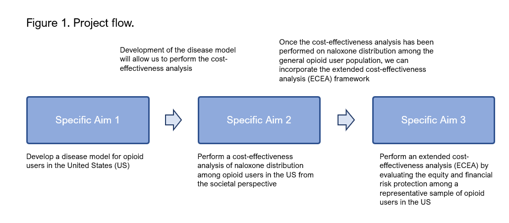

```{r setup, include=FALSE}
knitr::opts_chunk$set(echo = FALSE)
```


## Who I am {data-background=#02569B}

<style>
.container{
    display: flex;
}
.col{
    flex: 1;
}

</style>

<div class="container">
<div class="col">
<p class="fragment fade-up">  </p>
</div>

<div class="col">
<p class="fragment fade-up"> pharmacist </p>
<p class="fragment fade-up"> health economist </p>
<p class="fragment fade-up"> professor </p>
<p class="fragment fade-up"> program manager </p>
</div>

<div class="col">
<p class="fragment fade-up"> [](www.mbounthavong.com) </p>
<p class="fragment fade-up"> [](https://github.com/mbounthavong) </p>
</div>
</div>


## Where I'm from {data-background="index/images/griffith.jpg" data-state="dim-background"}


Los Angeles, CA

<p class="fragment fade-up"> Population: 3,849,297 </p>
<p class="fragment fade-up"> Median household income: $69,778 </p>
<p class="fragment fade-up"> Poverty: 16.6% </p>


## Where I am now {data-background="index/images/la_jolla.jpg" data-state="dim-background"}

<p class="fragment fade-up">  </p>
<p class="fragment fade-up">  </p>


## How did I get here? {data-background=#02569B}

<p class="fragment fade-up">  </p>


## How did I <bdi style="color:yellow;"> "really" </bdi> get here? 

<p class="fragment fade-up"> <span class="fragment highlight-red"> Mentors </span> , <span class="fragment highlight-blue"> Family/Friends </span> , & <span class="fragment highlight-green"> Mission/Purpose </span></p>

<p class="fragment fade-up"> If you feel <bdi style="color:red;"> lost </bdi>, that's okay </p>


## How I started {data-background="index/images/roadmap.jpg" data-state="dim-background"}

<div class="container">
<div class="col">
  
  <p class="fragment"> (1994-1999) </p> 
</div>

<div class="col">
  
  <p class="fragment"> (2000-2004) </p> 
</div>

<div class="col">
  
  <p class="fragment"> (2004-2005) </p> 
</div>

<div class="col">
  
  <p class="fragment"> (2005-2007) </p> 
</div>
</div>

<div class="container">
<div class="col">
  
  <p class="fragment"> (2007-2013) </p> 
</div>

<div class="col">
  
  <p class="fragment"> (2011-2013) </p> 
</div>

<div class="col">
  
  <p class="fragment"> (2012-2018) </p> 
</div>
</div>


## What I do {data-background-image=#02569B}

<p class="fragment fade-up">  </p>


## What I <bdi style="color:yellow;"> "actually" </bdi> do

<p class="fragment fade-up">  </p>


## VA Health Economics Resource Center

<p class="fragment">  </p>

<p class="fragment"> [VA HERC home page](https://www.herc.research.va.gov/include/page.asp?id=about-us) </p>


## VA HERC - CEA of opioid use disorder treatments
<div class="container">
<div class="col">
<p class="fragment">  </p>
</div>

<div class="col">
<p class="fragment">  </p>
</div>
</div>

<p class="fragment"> [JAMA Psychiatry. 2021;78(7):767-777.](https://jamanetwork.com/journals/jamapsychiatry/fullarticle/2778020) </p>


## VA HERC - Economics of opioid overdose

<div class="container">
<div class="col">
<p class="fragment">  </p>
</div>

<div class="col">
<p class="fragment">  </p>
</div>
</div>

<p class="fragment"> Paper is in peer review </p>


## VA San Diego Healthcare System
<div class="container">
<div class="col">
<p class="fragment">  </p>
</div>

<div class="col">
<p class="fragment"> <i>"The EDPP has proven to be not only cost saving for our medical center but also invaluable as a means of improving patient care and minimizing medication errors in the ED. More importantly, the EDPP has become a critical element in validating and demonstrating the <span class="fragment highlight-red">value of the pharmacist</span> as a member of the health care team."</i> </p>
</div>
</div>

<p class="fragment"> [AJHP. 2009;66(21):1943-1947.](https://academic.oup.com/ajhp/article-abstract/66/21/1943/5130388) </p>


## VA Pharmacy Benefits Management Academic Detailing Services {data-background=#02569B}

<p class="fragment">  </p>

<p class="fragment"> [VA PBM ADS home page](https://www.pbm.va.gov/PBM/academicdetailingservice/AboutUs.asp) </p>


## Government Accountability Office report (GA-18-380) 

<div class="container">
<div class="col">
<p class="fragment">  </p>
</div>

<div class="col">
<p class="fragment"> <i>"GAO is making five recommendations to VHA, including that it document actions and develop measurable outcomes related to its OSI goals, ensure that providers are adhering to opioid risk mitigation strategies, and ensure that all its regional networks have implemented <span class="fragment highlight-red">academic detailing programs</span> and that all VHA medical facilities have a designated primary care pain champion, as required."</i> </p>
</div>
</div>

<p class="fragment"> [GAO-18-380 Report](https://www.google.com/url?sa=t&rct=j&q=&esrc=s&source=web&cd=&ved=2ahUKEwjis-W-_uH9AhW6he4BHSaeC7gQFnoECA0QAQ&url=https%3A%2F%2Fwww.gao.gov%2Fassets%2Fgao-18-380.pdf&usg=AOvVaw0vrv6LmZQJPWHo_N71Yedl) </p>


## UCSD Skaggs School of Pharmacy & Pharmaceutical Sciences {data-background="index/images/ucsd_background.png"}


[UCSD homepage](https://pharmacy.ucsd.edu/)


## Extended cost-effectiveness analysis {data-background="index/images/ucsd_background.png"}

<div class="container">
<div class="col">
<p class="fragment">  </p>
</div>

<div class="col">
<p class="fragment">  </p>
</div>
</div>

<p class="fragment"> <i>"The overall aim of this pilot project is to identify strategies of distributing naloxone among a population of opioid users in the US that would maximize the equity and financial risk protection benefits."</i> </p>


## Mission - UCI

<p class="fragment">  </p>


## Oath of the Pharmacist

<p class="fragment">  </p>


## What are your mission, purpose, and vision?

<p class="fragment">  </p>

<p class="fragment"> [People With Purpose](https://www.peoplewithpurpose.com/blogs/purposemissionandvision) </p>


## Who I am and What I do

> * email: mbounthavong@health.ucsd.edu
> * website: https://mbounthavong.com
> * GitHub: https://github.com/mbounthavong
> * RPubs: https://rpubs.com/mbounthavong

